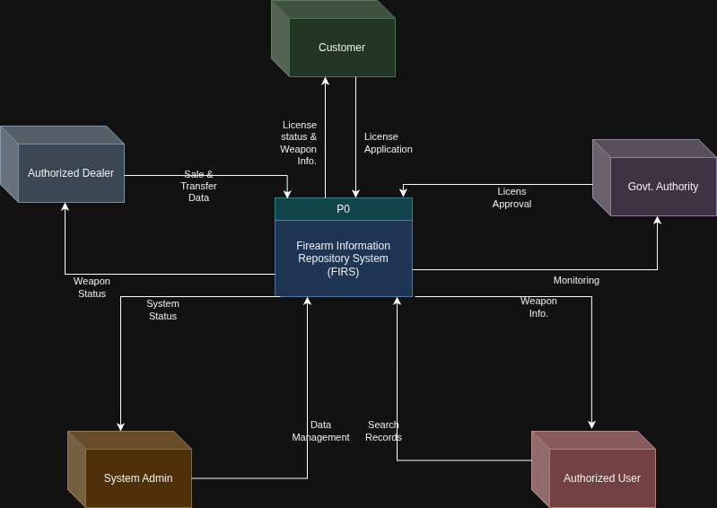
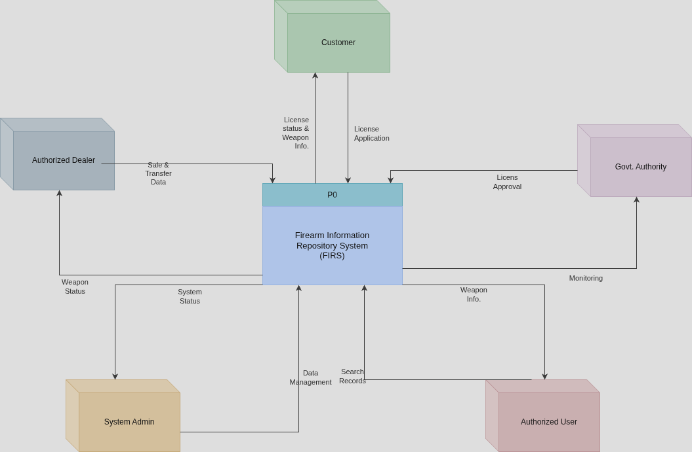

# Lab Title: Drawing Diagrams and Budget Preparation

## Entities, Process, and Data Flows

**Process P0: Firearm Information Repository System (FIRS)**

Central system for firearm registration, licensing, transactions, compliance, and reporting.

### External Entities (Updated)

1. **Customer**
   - License Application
   - License status & Weapon Info.

2. **Authorized Dealer**
   - Sales & Transfer Data
   - Weapon Status

3. **Govt. Authority**
   - License Approval
   - Monitoring

4. **Authorized User**
   - Search Records
   - Weapon Info.

5. **System Admin**
   - Data Management
   - System Status

---

### The Context Level DFD of FIRS

---

## Entities, Types & Relationships

### Entities & Attributes

#### 1. Firearm

- Firearm_ID (PK)
- Serial_Number
- Type
- Model
- Status

#### 2. Supplier

- Supplier_ID (PK)
- Name
- Contact_Number
- Address

#### 3. Authorized_User

- User_ID (PK)
- Name
- Rank
- Department

#### 4. Issue_Record

- Issue_ID (PK)
- Issue_Date
- Return_Date
- Firearm_ID (FK)
- User_ID (FK)

#### 5. Administrator

- Admin_ID (PK)
- Name
- Role

#### 6. Customer

- NID (PK)
- Name
- Address
- Phone

---

### a) The ER Diagram of FIRS

---

## 3. Estimating Costs Breakdown and Preparing the Budget (Total)

| WBS # | Task Title                | Task Owners                                                                                         | Hours Min  | Hours Max  | Avg Rate | Cost Min    | Cost Max    |
| ----- | ------------------------- | --------------------------------------------------------------------------------------------------- | ---------- | ---------- | -------- | ----------- | ----------- |
| 1     | Concept development       | Abu Ahmed Mahfuzur Rahman, Md Fahim Islam, Md. Mahfuzul Bashar Shaikot                              | 20         | 30         | 40       | 800         | 1,200       |
| 2     | Planning                  | Md Fahim Islam, Md. Mahfuzul Bashar Shaikot                                                         | 30         | 34         | 40       | 1,200       | 1,360       |
| 3     | Requirements analysis     | Md Fahim Islam, Md. Mahfuzul Bashar Shaikot                                                         | 20         | 28         | 40       | 800         | 1,120       |
| 4     | Design                    | Al Adid, Md Fahim Islam, Md. Mahfuzul Bashar Shaikot, Abu Ahmad Mahfuzor Rahman, Md. Sakibur Rahman | 50         | 60         | 30       | 1,500       | 1,800       |
| 5     | Development               | Md Fahim Islam, Md. Mahfuzul Bashar Shaikot                                                         | 2,200      | 2,400      | 30       | 66,000      | 72,000      |
| 5.1   | Deliverable #1            | Md Fahim Islam, Md. Mahfuzul Bashar Shaikot                                                         | 1,400      | 1,500      | 35       | 49,000      | 52,500      |
| 5.2   | Deliverable #2            | Md Fahim Islam, Md. Mahfuzul Bashar Shaikot, Md. Sakibur Rahman                                     | 1,300      | 1,400      | 37       | 48,100      | 51,800      |
| 5.3   | Deliverable #3            | Md Fahim Islam, Md. Mahfuzul Bashar Shaikot, Md. Sakibur Rahman                                     | 1,600      | 1,700      | 30       | 48,000      | 51,000      |
| 5.4   | Deliverable #4            | Md Fahim Islam, Md. Mahfuzul Bashar Shaikot, Md. Sakibur Rahman                                     | 1,800      | 1,900      | 37       | 66,600      | 70,300      |
| 5.5   | Deliverable #5            | Md Fahim Islam, Md. Mahfuzul Bashar Shaikot, Md. Sakibur Rahman                                     | 80         | 100        | 40       | 3,200       | 4,000       |
| 6     | Reporting and Measurement | Md Fahim Islam, Md Mahfuzul Bashar Shaikot                                                          | 200        | 240        | 35       | 7,000       | 8,400       |
| 7     | Implementation            | Abu Ahmad Mahfuzor Rahman, Al Adid                                                                  | 50         | 60         | 25       | 1,250       | 1,500       |
| 8     | Quality assurance         | Abu Ahmad Mahfuzor Rahman, Al Adid, Md Fahim Islam, Md Mahfuzul Bashar Shaikot, Md Sakibur Rahman   | 400        | 500        | 28       | 11,200      | 14,000      |
| 9     | QA Testing                | Abu Ahmad Mahfuzor Rahman, Al Adid                                                                  | 600        | 700        | 33       | 19,800      | 23,100      |
| 10    | Maintenance               | Md Sakibur Rahman, Md Fahim Islam, Md Mahfuzul Bashar Shaikot                                       | 140        | 150        | 35       | 4,900       | 5,250       |
| 11    | Launch                    | Al Adid, Md Sakibur Rahman, Md Fahim Islam, Md Mahfuzul Bashar Shaikot, Abu Ahmad Mahfuzor Rahman   | 130        | 135        | 140      | 12,000      | 14,000      |
| 12    | Closedown                 | Md Fahim Islam, Md. Mahfuzul Bashar Shaikot, Md. Sakibur Rahman                                     | 35         | 55         | 600      | 3,450       | 13,000      |
|       | **Totals**                |                                                                                                     | **10,055** | **10,992** |          | **344,800** | **386,330** |
