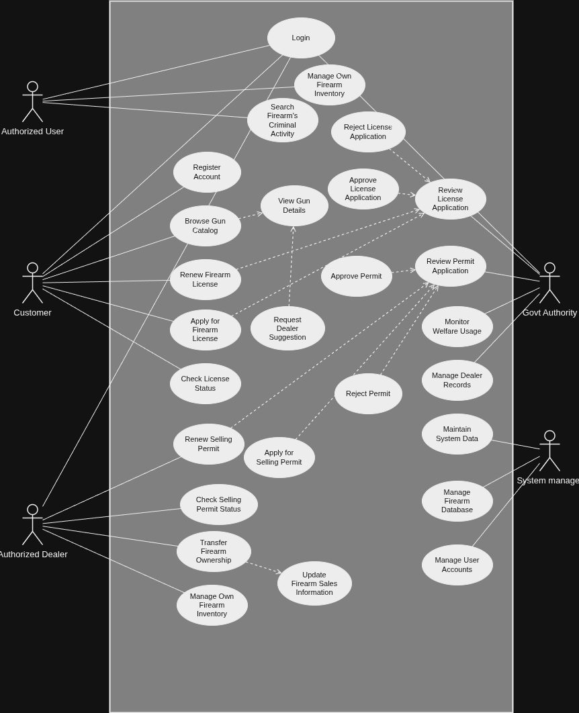
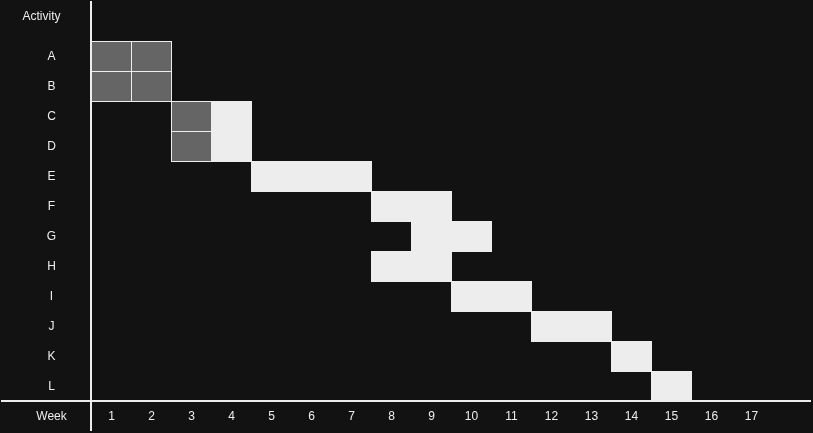

# Firearm Information Repository System (FIRS)

The **Firearm Information Repository System (FIRS)** is a centralized, secure, data-sensitive platform designed to manage firearm registration, licensing, transactions, compliance, and regulatory reporting[cite: 1, 2]. FIRS ensures strict validation and role-based workflows for citizens, commercial dealers, law enforcement, and government authorities[cite: 1, 2].

---

## 1. System Requirements & Architecture

### Primary Actors

- **Customers:** Individual citizens applying for, renewing, or checking the status of personal firearm licenses[cite: 2].
- **Authorized Dealers:** Commercial entities handling firearm sales, ownership transfers, and business permits[cite: 2].
- **Government Authority:** Regulatory bodies responsible for reviewing, approving, or rejecting licenses and selling permits[cite: 2].
- **Authorized Users:** Law enforcement or official personnel monitoring system usage and searching firearm histories[cite: 2].
- **System Admin:** Technical staff managing databases, accounts, and system maintenance[cite: 2].

### Key Include & Extend Relationships

- **`«include»`**: Licensing and permit applications automatically trigger authority review workflows; catalog browsing includes individual item detail views[cite: 2].
- **`«extend»`**: Approval or rejection actions extend the core review use cases conditionally depending on evaluation outcomes[cite: 2].

### System Use Case Diagram

---

## 2. Use Case Descriptions

<b>Click to expand the 25 Core Use Case Workflows</b>

### 1. Register / Login

- **Basic Flow:** User enters email and password $\rightarrow$ System verifies credentials $\rightarrow$ User is authenticated[cite: 2].
- **Alternate Flows:** Incorrect password triggers an error/reset prompt; duplicate emails suggest logging in[cite: 2].

### 2. Apply for Firearm License

- **Basic Flow:** Authenticated Customer fills out personal/firearm details, uploads required compliance documents, and submits[cite: 2].
- **Alternate Flows:** Missing files prompt an upload reminder; invalid data triggers validation errors[cite: 2].

### 3. Renew Firearm License

- **Basic Flow:** Customer selects an active license, verifies current data, and submits a renewal request[cite: 2].
- **Alternate Flows:** If a license is expired beyond the allowable grace period, the system rejects the request[cite: 2].

### 4. Check License Status

- **Basic Flow:** Customer navigates to status dashboard $\rightarrow$ System retrieves and displays real-time application status[cite: 2].

### 5. Browse Gun Catalog

- **Basic Flow:** User opens the catalog $\rightarrow$ System queries database and displays a list of available firearms[cite: 2].

### 6. View Gun Details

- **Basic Flow:** User selects an item $\rightarrow$ System displays detailed specifications, retail pricing, and dealer availability[cite: 2].

### 7. Request Authorized Dealer Suggestion

- **Basic Flow:** From gun details, the user requests a local supplier $\rightarrow$ System filters and displays authorized dealers stocking that model[cite: 2].

### 8. Apply for Selling Permit

- **Basic Flow:** Dealer enters business credentials, commercial licensing, and submits a permit request to the state[cite: 2].

### 9. Renew Selling Permit

- **Basic Flow:** Dealer selects their commercial permit, updates compliance logs, and transmits a renewal[cite: 2].

### 10. Check Selling Permit Status

- **Basic Flow:** Dealer accesses their profile dashboard to see real-time updates on pending regulatory permits[cite: 2].

### 11. Review License Application

- **Basic Flow:** Government Authority logs in, opens the pending queue, and examines applicant documents[cite: 2].

### 12. Approve License Application

- **Basic Flow:** Authority passes the background check $\rightarrow$ Confirms approval $\rightarrow$ System generates dynamic license number[cite: 2].

### 13. Reject License Application

- **Basic Flow:** Authority identifies an issue $\rightarrow$ Confirms rejection $\rightarrow$ System records reasons and alerts the applicant[cite: 2].

### 14. Review Selling Permit Application

- **Basic Flow:** Authority reviews commercial dealer applications against federal/local business compliance databases[cite: 2].

### 15. Approve Selling Permit

- **Basic Flow:** Verified dealer application approved $\rightarrow$ System updates store status to active authorized vendor[cite: 2].

### 16. Reject Selling Permit

- **Basic Flow:** Compliance or zoning issue detected $\rightarrow$ Permit is rejected with mandatory administrative notes[cite: 2].

### 17. Update Firearm Sales Information

- **Basic Flow:** Dealer logs a final transaction $\rightarrow$ System updates inventory counts and dynamic transaction registries[cite: 2].

### 18. Transfer Firearm Ownership

- **Basic Flow:** Dealer scans buyer's license $\rightarrow$ Verifies active validity $\rightarrow$ Updates system firearm record to new owner ID[cite: 2].

### 19. Search Firearms Related to Criminal Activity

- **Basic Flow:** Authorized Law Enforcement enters a serial number $\rightarrow$ System checks linked criminal investigative records[cite: 2].

### 20. Manage Firearm Inventory

- **Basic Flow:** Authorized entity reviews baseline inventory registries to add, modify, or remove catalog data[cite: 2].

### 21. Monitor Welfare Usage

- **Basic Flow:** Authority generates specialized system audits to ensure correct data compliance across operations[cite: 2].

### 22. Manage User Accounts

- **Basic Flow:** Administrator opens global user directory to update credentials, change roles, or deactivate accounts[cite: 2].

### 23. Manage Firearm Database

- **Basic Flow:** Administrator runs direct overrides, data entry modifications, and deletes corrupted catalog profiles[cite: 2].

### 24. Manage Dealer Records

- **Basic Flow:** Administrator updates commercial dealer metadata, business addresses, and primary contact records[cite: 2].

### 25. Maintain System Database

- **Basic Flow:** Administrator initializes automatic indexing tasks, clears system cache data, and triggers cold backups[cite: 2].

---

## 3. Design Methodology

FIRS utilizes a traditional **System Development Life Cycle (SDLC)** methodology rather than an Agile approach[cite: 2]. Due to the highly regulated, data-sensitive nature of firearm registration, requirements must remain stable, deeply documented, and legally verified prior to deployment[cite: 2].

### Why SDLC Is Suitable for FIRS:

1. **Stable Requirements:** Firearm licensing rules, background checks, and transfer protocols are dictated by rigid legal frameworks and are not subject to frequent product changes[cite: 2].
2. **Sequential Phase Validation:** Ensures high-risk functional features (such as criminal record searches and license approvals) are thoroughly designed and verified before development begins[cite: 2].
3. **Comprehensive Documentation:** Regulatory systems demand clean, auditable systems engineering artifacts, including dynamic System Requirements Specifications (SRS), database schemas, and UML diagrams[cite: 2].

---

## 4. Project Scheduling

The project is structured across a sequential timeline divided into discrete milestones spanning Analysis, Development, and Implementation phases[cite: 2].

### Project Breakdown Table

| Phase              | Task ID | Detailed Task Description              | Predecessor | Duration |
| :----------------- | :-----: | :------------------------------------- | :---------: | :------: |
| **Analysis**       |  **A**  | Define system objectives               |      —      | 2 Weeks  |
|                    |  **B**  | Study of laws & regulations            |      —      | 2 Weeks  |
|                    |  **C**  | Requirement analysis & SRS development |      A      | 2 Weeks  |
|                    |  **D**  | Feasibility & compliance study         |      B      | 2 Weeks  |
| **Development**    |  **E**  | System & database design               |      C      | 3 Weeks  |
|                    |  **F**  | User authentication module             |      E      | 2 Weeks  |
|                    |  **G**  | License management & inventory module  |      F      | 2 Weeks  |
|                    |  **H**  | Dealer transaction module              |      E      | 2 Weeks  |
|                    |  **I**  | Search & reporting module              |      H      | 2 Weeks  |
| **Implementation** |  **J**  | System integration                     |      G      | 2 Weeks  |
|                    |  **K**  | Testing & validation                   |      J      |  1 Week  |
|                    |  **L**  | Deployment & maintenance               |      K      |  1 Week  |

[cite: 2]

### Project Gantt Chart

