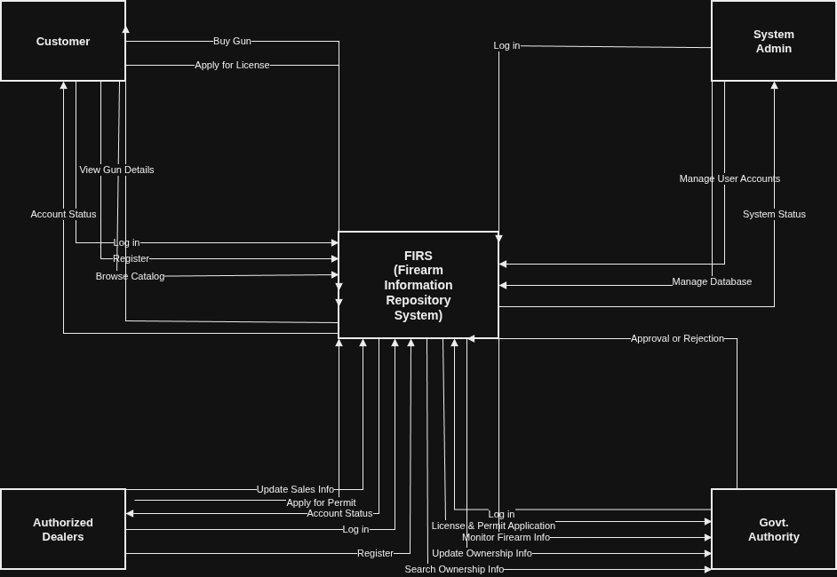

# Firearm Inventory Repository System (FIRS)

Welcome to the official repository for the **Firearm Inventory Repository System (FIRS)**. This system provides an integrated architecture to securely track, monitor, manage, and audit firearm lifecycle steps, licensing processes, and dealership transfers.

---

## 1. System Architecture & Diagrams

### Context Level DFD

Below is the Context Level Data Flow Diagram detailing how external entities interface with the core FIRS engine:

---

## 2. DFD Specifications & Data Flows

### External Entities

The system interfaces with four distinct external entities:

- **Customer**: Individuals seeking to view catalogs, apply for personal licenses, and purchase firearms safely.
- **Authorized Dealers**: Licensed vendors managing business inventory, reporting individual sales, and renewing selling permits.
- **Government Authority**: Regulatory bodies auditing data, reviewing legal requests, and granting approvals/rejections.
- **System Admin**: IT staff responsible for user accounts, backend optimizations, and system database stability.

### System Interfaces & Data Boundary Matrix

The following data routes represent the directional data flows moving across the system boundary:

| From Entity/System       | To Entity/System         | Transferred Data Flow        |
| :----------------------- | :----------------------- | :--------------------------- |
| **Customer**             | FIRS                     | Register                     |
| **Customer**             | FIRS                     | Log in                       |
| **Customer**             | FIRS                     | Browse Catalog               |
| **Customer**             | FIRS                     | Apply for License            |
| **Customer**             | FIRS                     | Buy Gun                      |
| FIRS                     | **Customer**             | View Gun Details             |
| FIRS                     | **Customer**             | Account Status               |
| **Authorized Dealers**   | FIRS                     | Register                     |
| **Authorized Dealers**   | FIRS                     | Log in                       |
| **Authorized Dealers**   | FIRS                     | Apply for Permit             |
| **Authorized Dealers**   | FIRS                     | Update Sales Info            |
| FIRS                     | **Authorized Dealers**   | Account Status               |
| **Government Authority** | FIRS                     | Approval or Rejection        |
| FIRS                     | **Government Authority** | License & Permit Application |
| FIRS                     | **Government Authority** | Monitor Firearm Info         |
| FIRS                     | **Government Authority** | Search/Update Ownership Info |
| **System Admin**         | FIRS                     | Log in                       |
| **System Admin**         | FIRS                     | Manage User Accounts         |
| **System Admin**         | FIRS                     | Manage Database              |
| FIRS                     | **System Admin**         | System Status                |

---

## 3. Level 1 DFD Architectural Breakdown

### Core Sub-Processes

FIRS is structured into five Level-1 functional sub-processes:

1. **1.0 Account Management**: Registers accounts and authenticates credentials.
2. **2.0 Firearm Catalog**: Handles public catalogs and localized display details.
3. **3.0 License & Permit**: Validates and process structural authorization workflows.
4. **4.0 Sales & Ownership**: Permanently registers transactions and links weapons to valid profiles.
5. **5.0 System Administration**: Executes operations monitoring, maintenance tasks, and diagnostic logs.

### Data Stores List

The architecture relies on 8 isolated data store modules:

- `D1` Customer Accounts
- `D2` Dealer Accounts
- `D3` Firearm Catalog
- `D4` License Records
- `D5` Permit Records
- `D6` Sales Records
- `D7` Ownership Records
- `D8` System Database

---

## 4. Level 2 Functional Input/Output Mapping

### ⚙️ Account Management

- **Inputs**: Register (Customer, Dealer) | Login (Customer, Dealer, Admin)
- **Outputs**: Account Status | Login Status
- **Data Stores Referenced**: `D1`, `D2`

### 🔫 Firearm Catalog Management

- **Inputs**: Browse Catalog (Customer)
- **Outputs**: View Gun Details
- **Data Stores Referenced**: `D3`

### 📄 License & Permit Management

- **Inputs**: Apply for License (Customer) | Apply for Permit (Dealer) | Approval/Rejection (Govt Authority)
- **Outputs**: License Status | Permit Status
- **Data Stores Referenced**: `D4`, `D5`

### 🛒 Sales & Ownership Management

- **Inputs**: Buy Gun (Customer) | Update Sales Info (Dealer) | Update Ownership Info (Govt Authority)
- **Outputs**: Sales Record | Ownership Info
- **Data Stores Referenced**: `D3`, `D6`, `D7`

### 🖥️ System Administration

- **Inputs**: Manage User Accounts (Admin) | Manage Database (Admin)
- **Outputs**: System Status
- **Data Stores Referenced**: `D8`

---

## 5. System CRUD Matrix

The following entity matrix outlines how system tasks affect the transactional entities and database tables (`C` = Create, `R` = Read, `U` = Update, `D` = Delete):

| Function / Activity                       | Customers | Dealers | Firearms | Sales | Licenses | Permits | Renewals | Approval Records |
| :---------------------------------------- | :-------: | :-----: | :------: | :---: | :------: | :-----: | :------: | :--------------: |
| **Register Account**                      |     C     |    C    |          |       |          |         |          |                  |
| **Login**                                 |     R     |    R    |          |       |          |         |          |                  |
| **Apply for Firearm License**             |     R     |         |          |       |    C     |         |          |                  |
| **Renew Firearm License**                 |     R     |         |          |       |    U     |         |    C     |                  |
| **Check License Status / Browse Catalog** |     R     |         |    R     |       |    R     |         |    R     |                  |
| **View Gun Details**                      |           |         |    R     |       |          |         |          |                  |
| **Request Dealer Suggestion**             |     R     |    R    |    R     |       |          |         |          |                  |
| **Apply for Selling Permit**              |           |    R    |          |       |          |    C    |          |                  |
| **Renew Selling Permit**                  |           |    R    |          |       |          |    U    |    C     |                  |
| **Check Selling Permit Status**           |           |    R    |          |       |          |    R    |    R     |                  |
| **Purchase Firearm**                      |     R     |    R    |   R/U    |   C   |    R     |    R    |          |                  |
| **Record Sale**                           |           |    R    |    U     |   C   |          |         |          |                  |
| **Review License Application**            |           |         |          |       |    R     |         |          |        R         |
| **Approve License Application**           |           |         |          |       |    U     |         |          |        C         |
| **Reject License Application**            |           |         |          |       |    U     |         |          |        C         |
| **Review Selling Permit**                 |           |         |          |       |          |    R    |          |        R         |
| **Approve Permit**                        |           |         |          |       |          |    U    |          |        C         |
| **Reject Permit**                         |           |         |          |       |          |    U    |          |        C         |

---
