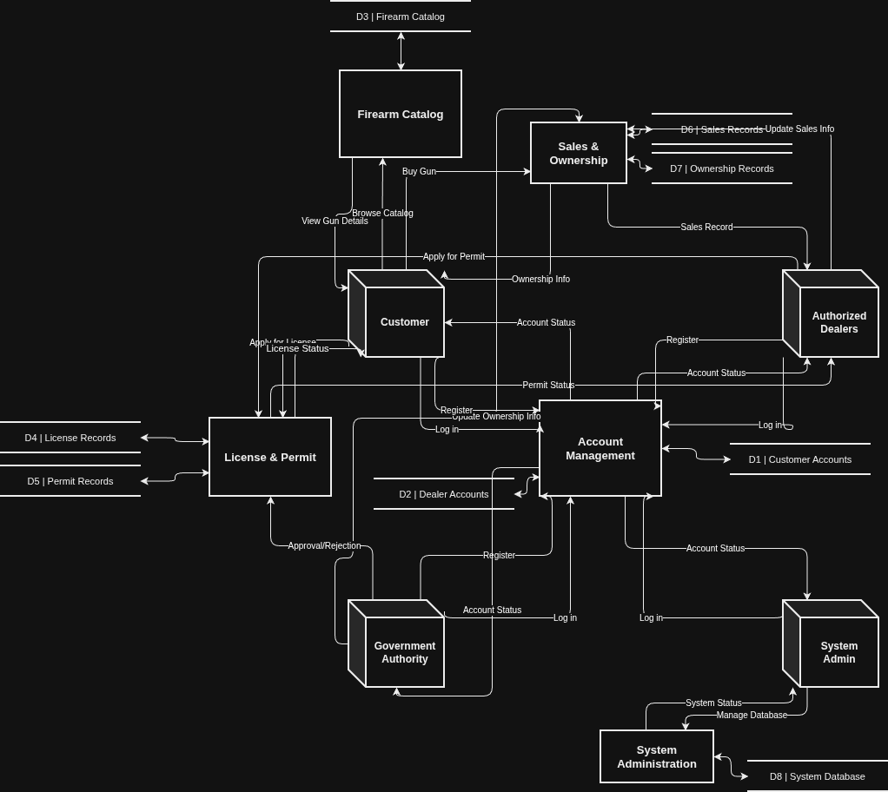

# Firearm Inventory Repository System (FIRS)

FIRS is a secure, comprehensive digital repository and workflow management system designed to track firearm lifecycles, licensing applications, dealer authorizations, legal retail sales, and compliance reporting.

---

## 1. System Architecture Diagram

### Level-1 Data Flow Diagram

The following architectural layout illustrates how external actors interact with the core sub-processes and data stores of the system:

---

## 2. System Specifications

### External Entities

The system interfaces with four core external entities:

- **Customer**: Applies for firearm licenses, browses the firearm catalog, requests firearm purchases, and checks application and purchase statuses.
- **Dealer**: Registers into the system, adds/updates firearm inventory, applies for dealer permits, and processes firearm sales.
- **Government Authority**: Reviews license applications, reviews dealer permits, approves or rejects requests, and monitors legal compliance.
- **System Admin**: Manages system users, controls database operations, generates reports, and monitors system activities.

### Core Processes (Level 1)

The backend functionality is broken down into six main processes:

1. 1. User Registration & Login
2. 2. Firearm Catalog Management
3. 3. License & Permit Management
4. 4. Firearm Sale Processing
5. 5. Approval / Rejection Management
6. 6. Reports & Record Tracking

### Data Stores

System state and records are maintained across five logical data repositories:

- **D1**: User Database
- **D2**: Firearm Database
- **D3**: License & Permit Database
- **D4**: Sales Database
- **D5**: Approval Database

---

## 3. System Data Flows

### Customer Data Flow

- **Customer -> 1. Registration/Login**: Inputs registration form and login data.
- **Customer -> 2. Catalog Management**: Inputs search requests.
- **Customer -> 3. License Management**: Inputs license applications and renewal requests.
- **Customer -> 4. Sale Processing**: Inputs firearm purchase requests.
- **System -> Customer**: Outputs catalog views, application statuses, and purchase confirmations.

### Dealer Data Flow

- **Dealer -> 1. Registration/Login**
- **Dealer -> 2. Catalog Management**: Inputs firearm details to add, update, or delete records.
- **Dealer -> 3. Permit Management**: Inputs permit applications.
- **Dealer -> 4. Sale Processing**: Inputs sales entries and stock updates.
- **System -> Dealer**: Outputs confirmations, approval statuses, and sales records.

### Government Authority Data Flow

- **Government Authority -> 3. License & Permit Management**: Inputs reviews for pending applications.
- **Government Authority -> 5. Approval Management**: Inputs approval or rejection decisions.
- **5.0 -> Government Authority**: Outputs updated records and monitoring information.

### Admin Data Flow

- **Admin -> 1. Login**
- **Admin -> 5. Approval Management**: Inputs review actions and decision controls.
- **Admin -> 6. Reports & Tracking**: Inputs report generation requests.
- **System -> Admin**: Outputs system reports, analytics, and activity logs.

---

## 4. Class Responsibility Collaborator (CRC) Cards

### CRC 1: User (Base Class)

- **Superclasses**: None
- **Subclasses**: Customer, Dealer, Admin
- **Object Think**: "We manage common user information and authentication"
- **Properties**: `UserId`, `name`, `email`, `password`, `phone`, `address`, `role`

| Responsibilities                                         | Collaborators                             |
| :------------------------------------------------------- | :---------------------------------------- |
| Register account, Login, Update profile, view dashboard. | Customer, Dealer, Admin, Database Manager |

### CRC 2: Customer

- **Superclasses**: User
- **Subclasses**: None
- **Object Think**: "We are a customer who wants to view firearms and apply/buy legally"
- **Properties**: `CustomerId`, `nid`, `dateOfBirth`, `licenseStatus`

| Responsibilities                                                                               | Collaborators                    |
| :--------------------------------------------------------------------------------------------- | :------------------------------- |
| Browse firearm catalog, apply for license, request firearm purchase, check application status. | Firearm, License, Sale, Approval |

### CRC 3: Dealer

- **Superclasses**: User
- **Subclasses**: None
- **Object Think**: "We manage firearms and sell them after proper verification."
- **Properties**: `dealerId`, `shopName`, `permitStatus`, `tradeLicenseNo`

| Responsibilities                                                        | Collaborators                   |
| :---------------------------------------------------------------------- | :------------------------------ |
| Add firearm data, update stock, apply for dealer permit, process sales. | Firearm, Permit, Sale, Approval |

### CRC 4: Admin

- **Superclasses**: User
- **Subclasses**: None
- **Object Think**: "We control the system and make official decisions."
- **Properties**: `adminId`, `designation`, `accessLevel`

| Responsibilities                                                                         | Collaborators                                       |
| :--------------------------------------------------------------------------------------- | :-------------------------------------------------- |
| Verify applications, approve/reject license and permit, manage reports, monitor records. | License, Permit, Approval, Report, Database Manager |

### CRC 5: Firearm

- **Superclasses**: None
- **Subclasses**: None
- **Object Think**: "We represent a firearm item stored in the system catalog."
- **Properties**: `firearmId`, `firearmName`, `category`, `model`, `manufacturer`, `serialNo`, `price`, `stock`, `status`

| Responsibilities                                                  | Collaborators                  |
| :---------------------------------------------------------------- | :----------------------------- |
| Store firearm details, update availability, provide catalog data. | Dealer, Sale, Database Manager |

### CRC 6: License

- **Superclasses**: None
- **Subclasses**: None
- **Object Think**: "We keep customer firearm license information."
- **Properties**: `licenseId`, `customerId`, `issueDate`, `expiryDate`, `status`, `applicationDate`

| Responsibilities                                                        | Collaborators             |
| :---------------------------------------------------------------------- | :------------------------ |
| Store customer license application, track issue/expiry, renewal status. | Customer, Admin, Approval |

### CRC 7: Permit

- **Superclasses**: None
- **Subclasses**: None
- **Object Think**: "We manage dealer authorization to sell firearms."
- **Properties**: `permitId`, `dealerId`, `permitType`, `issueDate`, `expiryDate`, `status`

| Responsibilities                                                  | Collaborators           |
| :---------------------------------------------------------------- | :---------------------- |
| Store dealer permit application, renewal status, approval result. | Dealer, Admin, Approval |

### CRC 8: Sale

- **Superclasses**: None
- **Subclasses**: None
- **Object Think**: "We record legal firearm purchase transactions."
- **Properties**: `saleId`, `firearmId`, `customerId`, `dealerId`, `saleDate`, `quantity`, `totalAmount`, `paymentStatus`

| Responsibilities                                                            | Collaborators                                        |
| :-------------------------------------------------------------------------- | :--------------------------------------------------- |
| Process firearm sale, verify customer license, generate transaction record. | Customer, Dealer, Firearm, License, Database Manager |

### CRC 9: Approval

- **Superclasses**: None
- **Subclasses**: None
- **Object Think**: "We store approval decisions made by the authority."
- **Properties**: `approvalId`, `requestType`, `requestId`, `decision`, `decisionDate`, `remarks`

| Responsibilities                                                             | Collaborators          |
| :--------------------------------------------------------------------------- | :--------------------- |
| Approve/reject license, permit, and renewal requests; keep decision history. | Admin, License, Permit |

### CRC 10: Report

- **Superclasses**: None
- **Subclasses**: None
- **Object Think**: "We create summarized information for monitoring and management."
- **Properties**: `reportId`, `reportType`, `generatedDate`, `generatedBy`

| Responsibilities                                                       | Collaborators                                  |
| :--------------------------------------------------------------------- | :--------------------------------------------- |
| Generate sales report, license report, permit report, renewal history. | Admin, Sale, License, Permit, Database Manager |

### CRC 11: Database Manager

- **Superclasses**: None
- **Subclasses**: None
- **Object Think**: "We connect all classes with the database."
- **Properties**: `connectionString`, `dbName`, `username`, `password`

| Responsibilities                                          | Collaborators                                          |
| :-------------------------------------------------------- | :----------------------------------------------------- |
| Store, retrieve, update, and delete data from all tables. | User, Firearm, License, Permit, Sale, Approval, Report |
